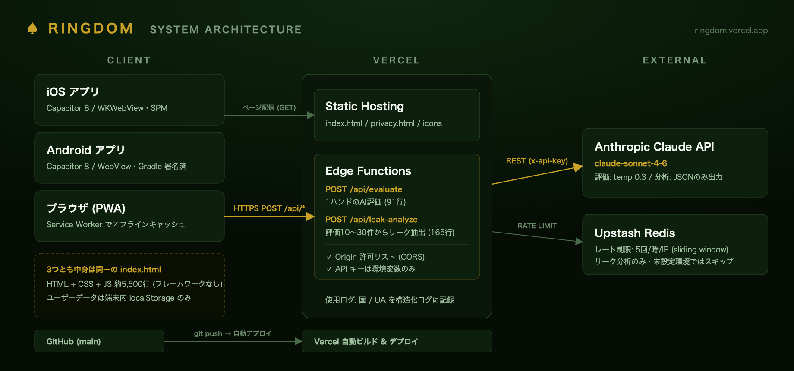

# RINGDOM システムアーキテクチャ

AIポーカーコーチアプリ **RINGDOM** (https://ringdom.vercel.app) のシステム構成と設計判断のまとめ。



## 全体像

| 層 | 構成 | 役割 |
|---|---|---|
| クライアント | 単一の `index.html` (HTML+CSS+JS 約5,500行・フレームワークなし) | Web/PWA・iOS・Android すべて同一コード。ユーザーデータは端末内 localStorage のみ |
| 配信・API | Vercel (Static Hosting + Edge Functions 2本) | `POST /api/evaluate` (1ハンドのAI評価)・`POST /api/leak-analyze` (評価履歴10〜30件からリーク抽出) |
| 外部サービス | Anthropic Claude API (`claude-sonnet-4-6`) / Upstash Redis | AI推論 / IP別レート制限 (リーク分析 5回/時・sliding window) |
| ネイティブ | Capacitor 8 (iOS: SPM / Android: Gradle) | Web資産を無改変でストアアプリ化。`npm run sync` で `www/` を生成して両OSへ配置 |
| CI/CD | GitHub → Vercel | `git push` で自動デプロイ。プレビューURLも自動発行 |

## 設計判断

### 1. ユーザーデータをサーバーに持たない
アカウント・DBなし。評価履歴もプレイヤー帳も端末内 localStorage に保存し、AI評価は毎回必要な情報をリクエストに同梱するステートレス設計。

- **得たもの**: 登録なしで即使える / 個人情報リスク・規約が最小 (ストアのプライバシー申告も「収集なし」) / 運用固定費 0円
- **引き換え**: 機種変更でデータが消える → クラウド同期は将来の Pro 機能候補として意図的に先送り

### 2. APIキーをクライアントに置かない
静的サイトから直接 Claude API を呼ぶとキーが露出するため、Vercel Edge Function をプロキシとして1枚はさむ。

```
アプリ → ① Origin検証 (CORS許可リスト) → ② レート制限 (Upstash) → ③ Claude API (キーは環境変数) → ④ 返却
```

- ネイティブアプリは `capacitor://localhost` で動くため、相対パス `/api/` が使えない → `apiUrl()` で本番URLに切替え、CORS許可リストにネイティブ Origin を明示追加
- AI出力は「評価:★ / 一言 / EV影響 / 代替案」とフォーマットをプロンプトで固定し正規表現で構造化。リーク分析は JSON のみを返すよう強制し、パース失敗時は生テキスト表示に退避
- カード表記 `5s` が「56 suited」と誤読される事故 → AIに渡す前にスートを記号化 (`5♠`)

### 3. 1つのHTMLを3プラットフォームへ (Capacitor)
フォーム入力と表示が中心のアプリなので WebView の性能で十分と判断し、React Native ではなく Capacitor を採用。既存Web資産の再利用と学習コスト最小を優先。

- Web/ストア版の出し分けは CSS クラスでほぼ完結: `isNativeApp()` が `<html>` に `.native-app` を付与し、`.web-only` (料金表示など) / `.native-only` を切替え
- ネイティブ専用差分は3点のみ: API絶対URL化 / Service Worker 無効化 / StatusBar テーマ色
- ストア審査対応: IAP外の課金案内NG (Apple 3.1.1)・β版表記NG (Apple 2.2) のため、ストア版では該当UIを非表示

## 数字

| 指標 | 値 |
|---|---|
| index.html 総行数 | 5,549行 (1ファイル) |
| フロントエンドのフレームワーク | 0 (vanilla JS) |
| API層の全コード | 256行 (Edge Function 2本: 91 + 165行) |
| ランタイム依存 | 6パッケージ (Capacitor 4 + Upstash 2) |
| 月額固定費 | 0円 (Vercel / Upstash 無料枠 + Claude API 従量) |

---
*構成図の再生成: スライド生成スクリプト (HTML→headless Chrome) から出力。2026-06 時点の構成。*
